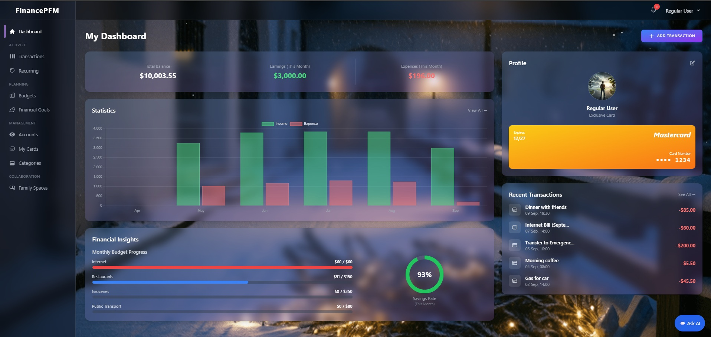
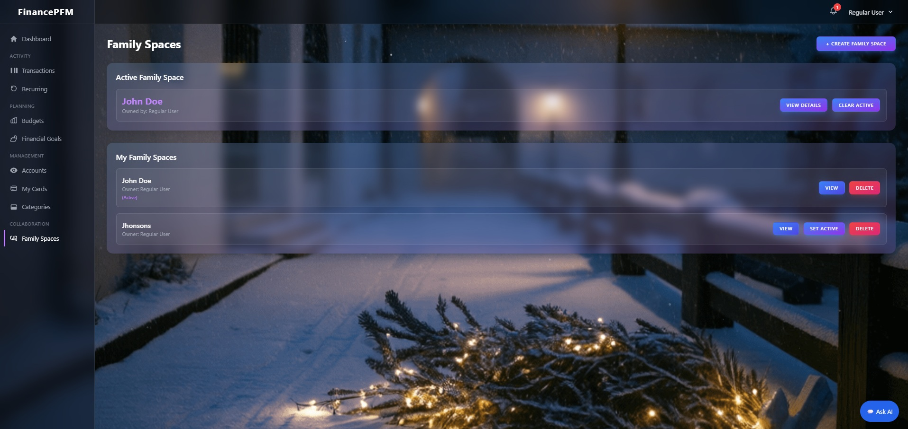

<<<<<<< HEAD
# Personal & Family Finance Management Application


# Personal Finance Management (PFM) Web Application

 Ini adalah proyek web aplikasi Manajemen Keuangan Pribadi (PFM) yang sederhana, intuitif, dan *user-friendly* yang dirancang untuk membantu individu dan keluarga mengelola keuangan mereka secara efektif.

## Fitur Utama

-   **Dashboard Interaktif:** Ikhtisar visual pendapatan, pengeluaran, dan saldo yang dapat disesuaikan.
-   **Manajemen Transaksi:** Catat, kategorikan, dan lacak transaksi dengan mudah.
-   **Kategori Kustom:** Buat kategori pendapatan dan pengeluaran yang dipersonalisasi.
-   **Laporan & Analisis:** Visualisasikan tren keuangan dengan grafik dan laporan.
-   **Anggaran:** Tetapkan dan pantau anggaran untuk berbagai kategori.
-   **Family Space:** Fitur kolaborasi untuk mengelola keuangan keluarga bersama.
-   **Keamanan:** Autentikasi pengguna dan perlindungan data.

## Tampilan Proyek (Screenshots)

Berikut adalah beberapa tampilan dari aplikasi PFM:

### Dashboard


### Fitur Family Space


## Teknologi yang Digunakan

-   **Backend:** PHP (Laravel 11)
-   **Frontend:** Tailwind CSS, Alpine.js
-   **Database:** MySQL (melalui XAMPP)
-   **Versi PHP yang disarankan:** 8.2 atau lebih tinggi

## Persyaratan Sistem

-   Web server (Apache/Nginx)
-   PHP 8.2+
-   MySQL Database
-   Composer
-   Node.js & NPM/Yarn (untuk aset frontend)

## Panduan Instalasi (Lokal)

Ikuti langkah-langkah di bawah ini untuk menjalankan proyek secara lokal:

1.  **Clone repositori:**
    ```bash
    git clone [https://github.com/jayabaya-studio/pfm-finance-app.git](https://github.com/jayabaya-studio/pfm-finance-app.git)
    cd pfm-finance-app
    ```
2.  **Instal dependensi Composer:**
    ```bash
    composer install
    ```
3.  **Buat file .env dan generate app key:**
    ```bash
    cp .env.example .env
    php artisan key:generate
    ```
4.  **Konfigurasi database:**
    Buka file `.env` dan konfigurasikan detail database Anda (DB_DATABASE, DB_USERNAME, DB_PASSWORD).
5.  **Jalankan migrasi database:**
    ```bash
    php artisan migrate
    ```
6.  **Instal dependensi Node.js & Compile aset frontend:**
    ```bash
    npm install
    npm run dev  # atau npm run build untuk produksi
    ```
7.  **Jalankan server pengembangan Laravel:**
    ```bash
    php artisan serve
    ```
    Aplikasi akan tersedia di `http://127.0.0.1:8000`.

## Kontribusi

Kontribusi disambut baik! Jika Anda menemukan bug atau memiliki saran fitur, silakan buka masalah atau kirim *pull request*.

## Lisensi

Proyek ini dilisensikan di bawah Lisensi MIT. Lihat file `LICENSE` untuk detail lebih lanjut.

## Dukungan Proyek

Jika proyek ini membantu Anda, Anda dapat mempertimbangkan untuk mendukungnya:
-   Beli saya kopi: [https://www.buymeacoffee.com/fathurrochim)

---
*Dibuat dengan ❤️ oleh Fathur Rochim*